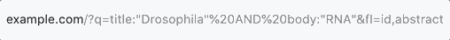
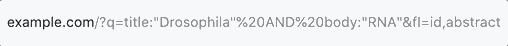

# url-spinner

[](https://badge.fury.io/js/url-spinner)

The spinner in your address bar. Inspired by http://wavyurl.com






## Get started

### Install

With npm: `npm install url-spinner`

### Usage

Simple example

```javascript
import { startSpinning } from "url-spinner";

const stopSpinning = startSpinning();

// Perform some async tasks and call stopSpinning at a proper time
setTimeout(stopSpinning, 3000);
```

To stop spinning automatically by 3s later

```javascript
startSpinning({ duration: 3000 });
```

To customize the spinner

```javascript
startSpinning({
  duration: 3000,
  spinner: ["🌚", "🌘", "🌗", "🌖", "🌝", "🌔", "🌓", "🌒"]
});
```


## Apis

`startSpining(options: UrlSpinnerOptions)`

```typescript
export interface UrlSpinnerOptions {
  spinner?: string[];
  duration?: number;
}
```

## License

MIT ([Chuang Yu <cyu9960@gmail.com>](https://github.com/cyyyu))
